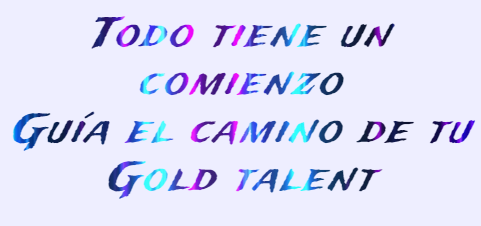

✨ Landing Page

Estoy contento con el resultado aún a día de hoy, podría ser una landing page real, me gusta el diseño, el formato, las cajas, el responsive para móviltes/tablets y las animaciones de los títulos y sobre todo la del formulario. Al cual apliqué técnicas css modernas para los inputs y los iconos. Teniendo en cuenta que fue mi segundo proyecto serio, quedé muy satisfecho.

Preparé el contexto de una empresa que ofrece desarrolladores para otras empresas interesadas.
Get Gold Talent incidía en que la empresa que adquiriese su Gold Talent developer continuase su formación, pues los tiene en alta estima y
no les gustaría ver frenado su potencial y su desarrollo. 🚀🚀🚀

Get Gold Talent, a procurado seleccionarlos con los skills necesarios y desde ahí ha continuado su formación.

Ahora Ofrece developers con las Softs Skills que detallan. Y a partir de ahí preparan 3 modelos a conveniencia de los potenciales clientes (empresas interesadas).

👉 [Get Gold Talent](https://conancos.dev/getgoldtalent/)

